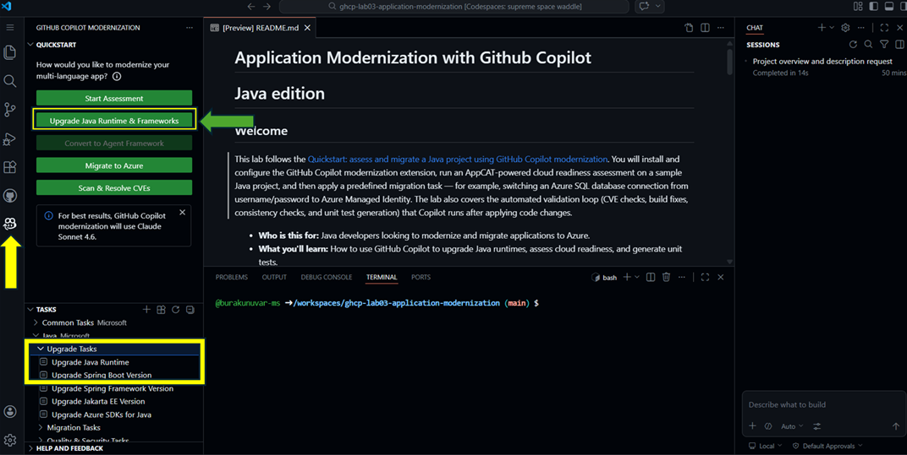
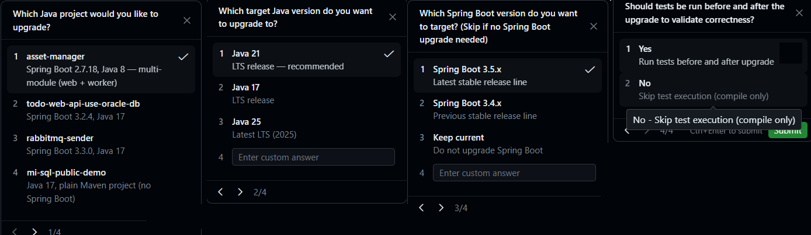
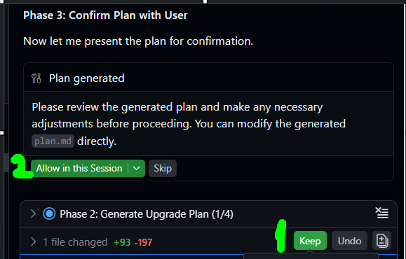
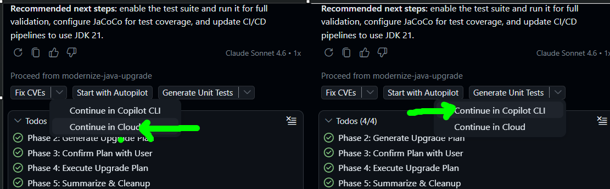
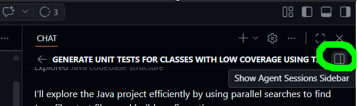
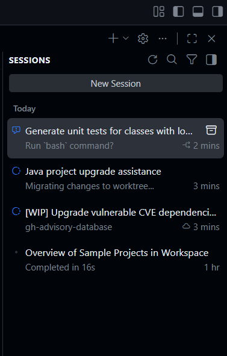

## Upgrade JDK and dependency versions

- Click on **GitHub Copilot modernization** agent icon on the left pane in VS Code.  You will notice two different ways to upgrade your Java runtime and dependencies.

- **Upgrade the JDK** — Either click **Upgrade Runtime & Frameworks** in the Quickstart section, or run the **Upgrade Java Runtime** task under Tasks > Upgrade Tasks.

In this lab, please proceed from the Quickstart. 

  

There're 4 java projects in this repo to provide you a broader view and experience. For the application modernization we'll use the asset manager. After an analysis, Copilot will request your chose, please select asset manager. 

- Proceed with options such as follows : Select Java 21 (LTS), Spring Boot Latest Stable, No-skip test execution 

  

- Allow Copilot to run the commands, make edits while it prepares the implementation plan.  

Quick read in the meantime : [GitHub Copilot modernization for Java](https://learn.microsoft.com/en-us/azure/developer/java/migration/migrate-github-copilot-app-modernization-for-java) is an AI-powered assistant built on GitHub Copilot agent mode that delivers end-to-end support for modernizing Java applications. It automates complex tasks such as upgrading Java runtimes (versions 8, 11, 17, and 21), migrating Spring Boot applications, remediating security vulnerabilities (CVEs), and preparing apps for deployment on Azure. It integrates open-source tools like OpenRewrite alongside predefined and custom migration tasks to reduce manual effort while keeping developers in full control. Beyond code upgrades, it also handles containerization and cloud deployment to targets like Azure Container Apps and AKS.

- Keep all edits, Click **Allow in this Section"** and Copilot will proceed with execution phase.  Allow Copilot App Modernization Agent to run the commands, make edits while it modernizes the application.

  

- Check the summary file when Copilot App Modernization Agent completes Todos.

- OPTIONAL : We'll have another section for unit tests. But if you'd like to broaden your Github Copilot experience across all surfaces beyond IDE including UI and CLI; try to see a fleet of agents in action:

  

 - -  Delegate Fix CVE's to Copilot in UI and (Don't commit changes but just delegate )
 - -  Delegate Generate Unit Tests to Copilot CLI  (Move changes)

From top right of the screen, click **"Show Sessions Side Bar"** and observe 3 agents in 3 platforms running simultaneously. 

  

  

- There's no dependency for the next step. You can either wait for agents to complete their tasks or proceed with [steps/2-step.md](2-step.md)

## Resources

- [Quickstart: upgrade a Java project with GitHub Copilot modernization](https://learn.microsoft.com/en-us/azure/developer/github-copilot-app-modernization/quickstart-upgrade)
- [Upgrade a Java framework or third-party dependency by using GitHub Copilot modernization](https://learn.microsoft.com/en-us/azure/developer/github-copilot-app-modernization/framework-upgrade)
