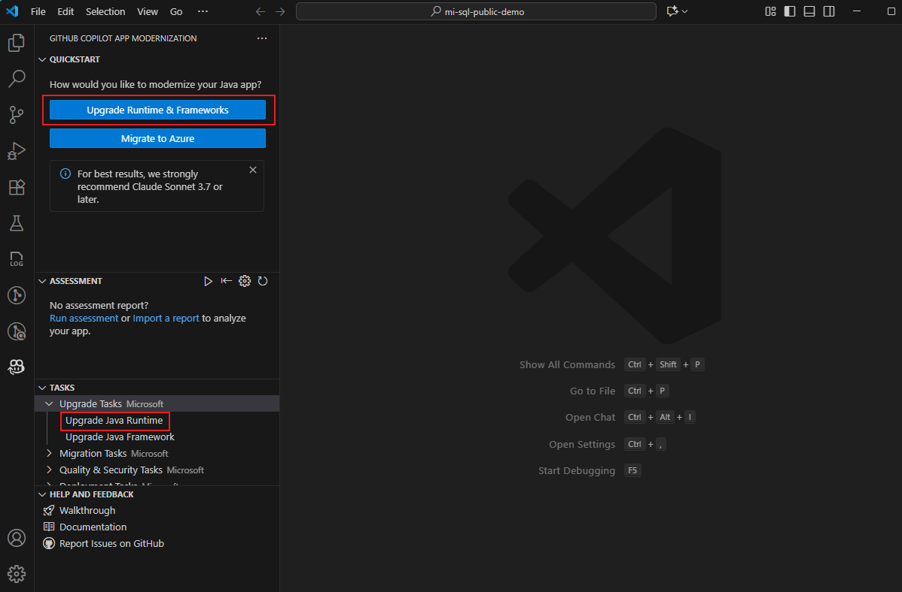

## Upgrade JDK and dependency versions

There are two ways to upgrade your Java runtime and dependencies using the GitHub Copilot modernization pane in VS Code:

- **Upgrade the JDK** — Either click **Upgrade Runtime & Frameworks** in the Quickstart section, or run the **Upgrade Java Runtime** task under Tasks > Upgrade Tasks.

OR

- **Upgrade frameworks/third-party dependencies** — Run the **Upgrade Java Framework** task under Tasks > Upgrade Tasks to bump things like Spring or other libraries.

Both options are accessed from the GitHub Copilot modernization sidebar panel in VS Code.

- To upgrade the Spring framework or a third-party dependency, run the **Upgrade Java Framework** task in the **TASKS - Upgrade Tasks** section.

## Resources

- [Quickstart: upgrade a Java project with GitHub Copilot modernization](https://learn.microsoft.com/en-us/azure/developer/github-copilot-app-modernization/quickstart-upgrade)
- [Upgrade a Java framework or third-party dependency by using GitHub Copilot modernization](https://learn.microsoft.com/en-us/azure/developer/github-copilot-app-modernization/framework-upgrade)
