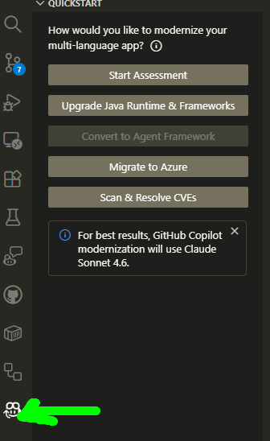
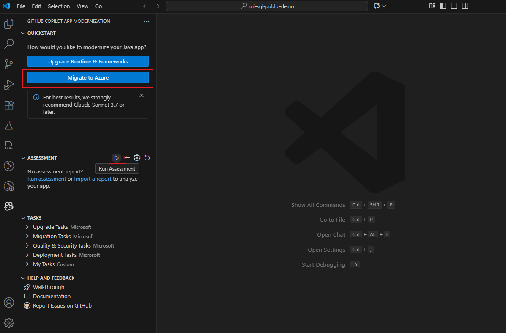
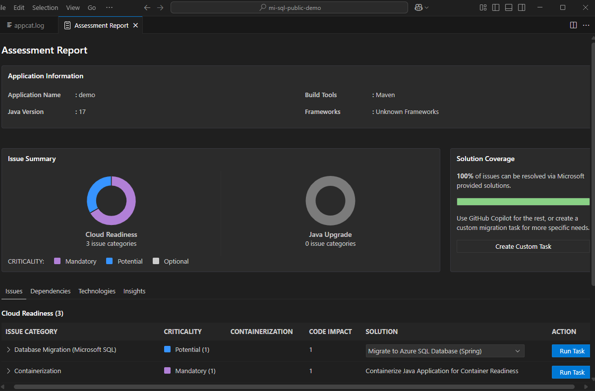

## Assess Cloud Readiness

**Assess cloud readiness** is a step in the GitHub Copilot App Modernization workflow where the tool analyzes your Java project to identify migration blockers and challenges before moving to Azure. Here's what it does:

1. **Runs AppCAT** (Azure Migrate application and code assessment tool) against your project to perform a static analysis of cloud readiness issues.
2. **Produces a categorized Assessment Report** that lists issues, explains their impact, and provides recommended solutions (e.g., Azure resource setup, configuration changes, code fixes).
3. **Allows you to act on findings** — for example, selecting a solution like "Migrate to Azure SQL Database (Spring)" from the report and clicking **Run Task** to proceed to automated code remediation.

In short, it gives you a structured, AI-assisted picture of *what needs to change* in your Java app before it can run on Azure, and guides you to the next migration step.

## 

- Open The mi-sql-public-demo Project 

The File menu is in the top menu bar of VS Code, at the very top-left of the window. Click it to see options like Open Folder, New File, Save, etc. Use **File → Open Folder** and navigate to:
`C:\.......\ghcp-lab03-application-modernization\mi-sql-public-demo`

> **Note:** Using **File → Open Folder** on `mi-sql-public-demo` will replace the current workspace and lose the multi-folder view. To get back when/if needed, use **File → Open Folder** and navigate to `C:\.......\ghcp-lab03-application-modernization`, or press `Ctrl+R` to reopen it from recent workspaces.

- On the sidebar, select the GitHub Copilot modernization pane, where you can select Migrate to Azure or Run Assessment in the ASSESSMENT section. 

- The GitHub Copilot chat window with agent mode opens to call the modernization assessor to execute the GitHub Copilot modernization assessment. Select Continue to confirm.

- The modernization assessor now opens appcat.log. This file shows the logs for running AppCAT, which performs the app assessment. Select Continue to confirm again.

- The modernization assessor verifies your local environment first. If the AppCAT and its dependencies aren't installed, the agent helps you install them. After installation, the agent calls AppCAT to assess the current project. This step could take several minutes to complete.

- Upon completion of the analysis, the modernization assessor produces a categorized view of cloud readiness issues in an opened Assessment Report.

- INFO ONLY  - NO ACTION NEEDED FOR THIS TODAY : When reviewing the summary report, you can select Migrate to Azure SQL Database (Spring) from the solution list under the issue Database Migration (Microsoft SQL). Then, select Run Task to move to the code remediation stage