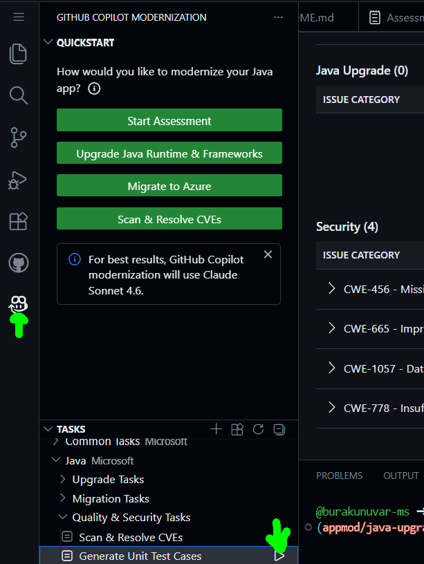

## Generate Unit Test Cases

To generate unit test cases, use the following steps:

- On the sidebar, select the GitHub Copilot modernization pane.

- In the TASKS section, open Quality & Security Tasks, and then select Generate Unit Test Cases.

  

The agent generates unit tests and creates a TestReport to show test results before and after generation.

For more information, see [Quickstart: generate unit tests with GitHub Copilot modernization](https://learn.microsoft.com/en-us/azure/developer/github-copilot-app-modernization/quickstart-unit-tests)
